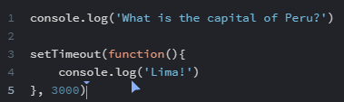

# Cookie Consent

This is a code-along project from **Scrimba**'s **[Frontend Developer Career Path](https://scrimba.com/learn/frontend)**.

_Aside: If you haven't heard of Scrimba, they are a tremendously great learning platform with an in-built editor. You can learn from their teachers and pause the videos and directly code and see your code. They also quite frequently update the learning path. Hence I'm going back to quickly re-do the new projects they keep putting up! I do this when I see interesting new projects, giving me a chance to review concepts._

This is the first project in Module 5 Essential JavaScript Concepts.

## Things I (Re)Learned (i.e. - gained a greater understanding of)

### How to center a modal using position fixed

Generally I only set the `top` and `left` properties, but using them all along with `margin: auto;` instantly centers the modal. This is much quicker than using `transform: translate(-50%, -50%)`!

I also got a reminder that `position: fixed` fixes the position of whatever element to the **viewport**. You can even scroll and the modal will stay right smack dab in the middle, because the viewport doesn't change.

### A better/new understanding of setTimeout()

I had never really considered that this method removes something from the flow of your main JavaScript code, which executes from top to bottom.

This takes in 2 parameters: `(function, delay)`.
We can use an **anonymous function**, then set the delay in **milliseconds**.

A **gotcha** is remembering `setTimeout()` takes it completely out of the flow. So if you have multiples that you want to go in a certain sequence, you need to set each time accordingly. Like _one at 3000 and the next at 6000._

### Submit Buttons

Although it makes sense, I had never considered the following fact. Any button in a form will be a **Submit** button. It doesn't even matter how you add it to the html, it automatically submits the form.

