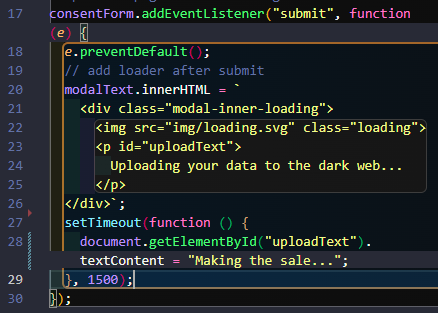

# Cookie Consent

This is a code-along project from **Scrimba**'s **[Frontend Developer Career Path](https://scrimba.com/learn/frontend)**.

_Aside: If you haven't heard of Scrimba, they are a tremendously great learning platform with an in-built editor. You can learn from their teachers and pause the videos and directly code and see your code. They also quite frequently update the learning path. Hence I'm going back to quickly re-do the new projects they keep putting up! I do this when I see interesting new projects, giving me a chance to review concepts._

This is the first project in Module 5 Essential JavaScript Concepts. It starts out with a click-bait-worthy article promising an express journey to developer mastery, then is quite quickly interrupted with this rather scary popup.

Once the user accepts the terms, _and they must with this form_, the popup modal is changed to this:

To pile on the misery, the message changes to simulate the user's info being sold on the dark web!

---

All in all it's a project that you would, _hopefully_, never be asked to make in reality, but it offered lots of practice.

## Things I (Re)Learned (i.e. - gained a greater understanding of)

### How to center a modal using position fixed

Generally I only set the `top` and `left` properties, but using them all along with `margin: auto;` instantly centers the modal. This is much quicker than using `transform: translate(-50%, -50%)`!

I also got a reminder that `position: fixed` fixes the position of whatever element to the **viewport**. You can even scroll and the modal will stay right smack dab in the middle, because the viewport doesn't change.

### A better/new understanding of setTimeout()

I had never really considered that this method removes something from the flow of your main JavaScript code, which executes from top to bottom.

This takes in 2 parameters: `(function, delay)`.
We can use an **anonymous function**, then set the delay in **milliseconds**.

A **gotcha** is remembering `setTimeout()` takes it completely out of the flow. So if you have multiples that you want to go in a certain sequence, you need to set each time accordingly. Like _one at 3000 and the next at 6000._

### Submit Buttons

Although it makes sense, I had never considered the following fact. Any button in a form will be a **Submit** button. It doesn't even matter how you add it to the html, it automatically submits the form.

The only real advantage to using the `button` tag is you can style it a bit more, like making it an image.

If using this tag, giving it a `type="submit"` will help distinguish it from other buttons.

Also learned a new thing, when you fill out the form and hit submit, it will show up in the URL!

As forms are sent off to a server, it creates this **query string**, `?fullName=John+Doe` followed by an ampersand for the next entered field. Since this is a frontend project, we need to use `e.preventDefault()`. We'd also do this when the user would still be interacting with the page.

**What about when there is more than one button on a form?**

Since all buttons in a form are automatically considered Submit buttons, you will need to manually change it's `type="button"`.

### TypeError: Cannot set properties of null

I made an error thinking I was organizing my code well by placing all the variables at the top. That is a great practice, but I encountered an issue when making additional changes to the modal.

Here is the page flow:

1. The modal pops up ludicrously fast
2. The poor user is forced to input their data and Accept the terms.
3. The modal changes to a loader saying 'it's contacting the dark web.'
4. Then just the new text changes to 'making the sale...'

I accessed the text via line 23's `id="uploadText"`, and preceeded to change the text after an interval. BUT I ran into a **TypeError**.

Remembering that JavaScript reads from top to bottom, grabbing `uploadText` and putting it at the top will just confuse JS, because it's not created until down in the file.

The **solution**? Grab the element after initialization!

### FormData

Allows you access to the user's inputted data. `FormData` is a **function** that will return it all as an **object** that can then be sent off to a server from processing.

Assign it to the `new` keyword as it's a **constructor** then `FormData(form variable name)`. You can `console.log` it, but FormData gives a special kind of object - meaning you don't immediately have access to it!

**Note**: Make sure you are passing the form element and not a string (like "consentForm") or you will get a **Uncaught TypeError: Failed to construct 'FormData': parameter 1 is not of type 'HTMLFormElement'**.

**How to extract the data?**

You need to use the `.get()` method on the `FormData` object, then pass the name attribute from the HTML input as a **string**.

